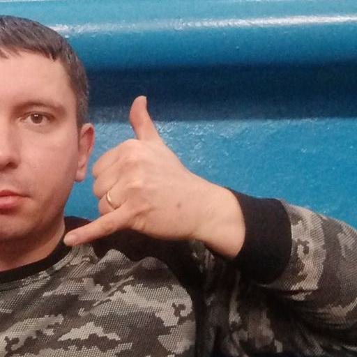
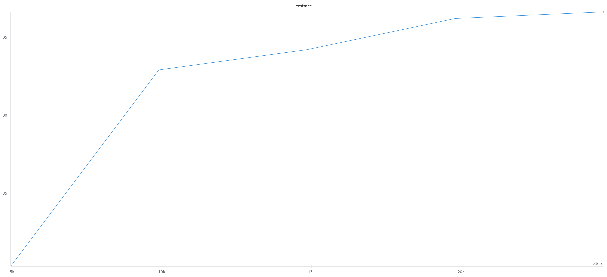
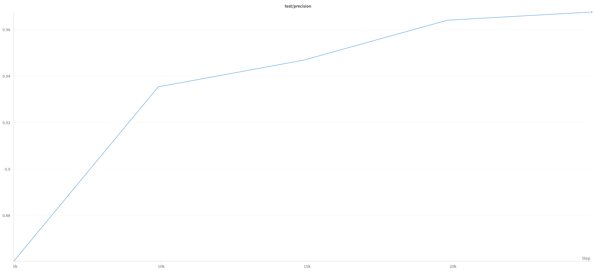
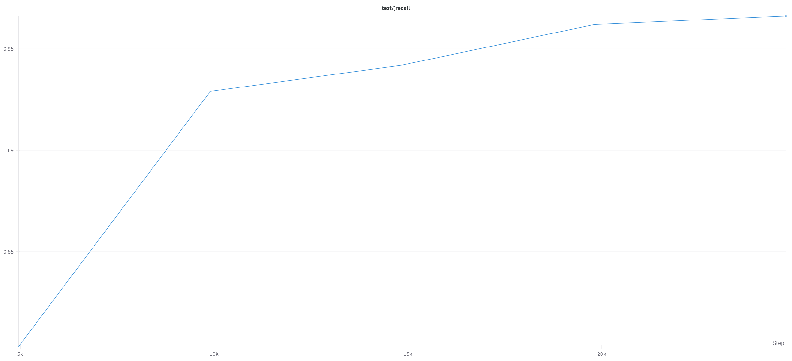
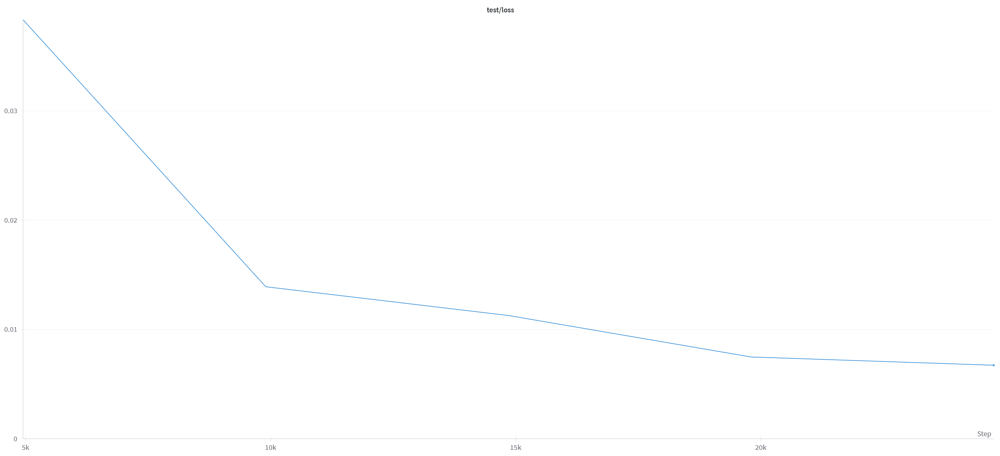
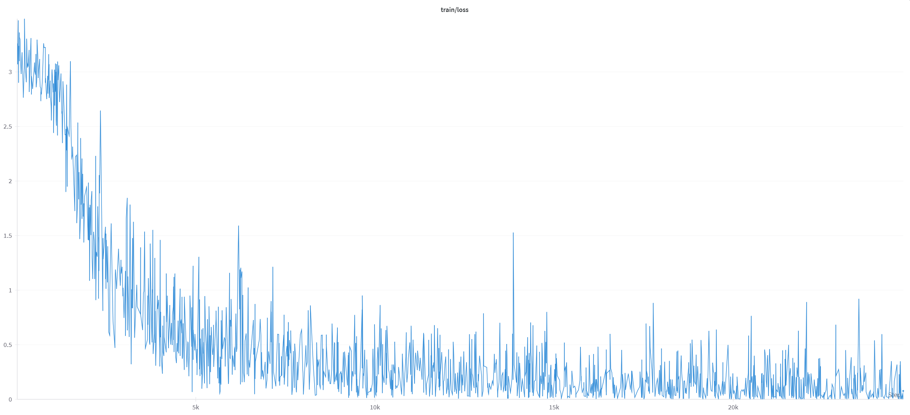

# Hand-Gesture-Recognition Report

   
Samuel Janas 151927, Bruno Urbaniak 151955

## 1. **Description of the Data Set:**
   - We decided to work on dataset called HaGRID Classification 512p (Hand Gesture Recognition Dataset) with 509,153 training images. This dataset is a modified HaGRID dataset for image classification instead of object recognition. It contains 18 classes of cropped out hand gestures with resolution of 512x512 pixels. For training and testing pourposes we decided to use 5500 images from each class.

  

  
  
  

## 2. Problem Description

   - The problem we are trying to solve is to recognize hand gestures in a real-time video stream. This task requires two main subtasks to be solved:
     -  recognition and tracking of a hand in a video
     -  successfully classifying the gesture

## 3. Used Architectures

We defined two custom neural network architectures - **CustomCNN** and **SelfMadeResNet**. Both being inspired by the ResNet architecture.

### `CustomCNN` Architecture

- **Convolutional Blocks (`conv1`, `conv2`, `conv3`, `conv4`):**
  - Each block includes a 3x3 convolutional layer, batch normalization, and ReLU activation.
  - The first block (`conv1`) takes the input channels and produces 64 output channels.
  - The second block (`conv2`) increases the number of channels to 128 and includes a max-pooling layer.
  - The remaining blocks (`conv3`, `conv4`) further increase the channels and include max-pooling for downsampling.

- **Residual Blocks (`res1`, `res2`):**
  - Each residual block consists of two convolutional blocks.
  - The output of the first convolutional block is added to the input, creating a residual connection.
  - This is followed by another convolutional block.

- **Classifier:**
  - The classifier section includes adaptive max-pooling, flattening, dropout, and a linear layer for classification.
  - It adapts to a 1x1 spatial size and produces the final classification output.

---

### `SelfMadeResNet` Architecture

- **Initial Convolution (`conv1`):**
  - A 7x7 convolutional layer with a stride of 2 for initial feature extraction.
  - Followed by batch normalization and ReLU activation.

- **Residual Blocks (`layer1`, `layer2`):**
  - `layer1` consists of three residual blocks with 64 output channels.
  - `layer2` consists of four residual blocks with 128 output channels.
  - Each residual block includes two convolutional layers and a residual connection.

- **Average Pooling and Classifier:**
  - Adaptive average pooling reduces spatial dimensions to 1x1.
  - Flattening is followed by a fully connected layer for classification.

------------

### Diagram of the model
https://github.com/SamuelJanas/Hand-Gesture-Recognition/blob/main/Digraph.gv.pdf

## 4. Model Analysis

### Size in Memory
 - Forward/backward pass size (MB): 444.07
 - Params size (MB): 25.10
 - Estimated Total Size (MB): 469.75
### Number of Parameters
 - number of parameters: **6579474**

## 5. Training Details

#### 5.1 Data Loading:

- Data loading is handled by the `load_data` function from the `utils.data` module. 
- The dataset is split into training and testing sets based on the specified `split_ratio` in the configuration.
- Images are resized to `(cfg.data.image_size, cfg.data.image_size)`, transformed to tensores and normalized with mean and standard deviation.
- PyTorch `DataLoader` is used to create batches of data for both training and testing.

#### 5.2 Training Loop:

- The training loop (`train_epoch` function) follows a standard procedure:
  - Iterate over batches from the training data loader.
  - Transfer data and labels to the specified device (GPU or CPU).
  - Zero the gradients, forward pass, compute loss, backward pass, and optimization step.
  - Log the loss to Weights and Biases (wandb) every 10 batches.
  - Save a checkpoint if the current average loss is the best so far.

#### 5.3 Testing Loop:

- The testing loop (`test_epoch` function) evaluates the model on the test set:
  - Iterate over batches from the test data loader.
  - Transfer data and labels to the specified device.
  - Perform inference and compute test loss and accuracy.
  - Log the test loss and accuracy to wandb.
  - Save a checkpoint if the current accuracy is the best so far.

#### 5.4 Checkpointing:

- The code saves checkpoints during training:
  - For the training loop, the best loss checkpoint includes the epoch, best loss, model's state_dict, and optimizer's state_dict.
  - For the testing loop, the best accuracy checkpoint includes the epoch, best accuracy, and model's state_dict.

#### 5.5 Training Configuration:

- The training script is configured using Hydra. The configuration file is located in the 'config' directory, and the default configuration is named 'default'. The configuration includes parameters like seed, project name for wandb, learning rate, number of epochs, etc.

#### 5.6 Logging:

- The script logs training loss, test loss, and accuracy to Weights and Biases (wandb).

#### 5.7 Optimizer and Loss Function:

- The Adam optimizer is used with a specified learning rate.
- Cross-entropy loss is employed as the loss function.

### Overall Training Procedure:

- The main function `main()` initializes wandb, sets the seed, loads the model, optimizer, and criterion, loads the data, and runs the training and testing loops for a specified number of epochs.

## 6. Metrics, Loss, and Evaluation

### Metrics
- **Accuracy:** The accuracy is the ratio of correct predictions to the total number of predictions. It is a common metric for classification tasks.
- **Precision**: Precision is the ratio of true positives to the sum of true positives and false positives.
- **Recall:** Recall is the ratio of true positives to the sum of true positives and false negatives.
  
### Loss Function
- **Cross-entropy Loss:** The cross-entropy loss is a common loss function for classification tasks. It is used to measure the performance of a classification model whose output is a probability value between 0 and 1. The loss is calculated as the negative log-likelihood of the correct class. The loss is minimized by maximizing the log-likelihood of the correct class.

## 7. Plots
Here are some plots from our training and testing process of our best model.

### Test Accuracy

### Test Precision

### Test Recall

### Test Loss

### Train Loss

## 8. Hyperparameters

We performed a hyperparameter tuning experiments using Weights and Biases (wandb). The following hyperparameters were selected for the final model:

### Learning Rate:
   - **Value:** `3e-4`
   - **Explanation:** The learning rate determines the size of the step that the optimization algorithm takes during training. We have chosen the value of `3e-4` since it is a common starting point. It's neither too large, which could cause the model to diverge, nor too small, which could result in slow convergence.

### Batch Size:
   - **Value:** `16`
   - **Explanation:** The batch size defines the number of training samples processed in one iteration. A batch size of `16` is relatively small, which can lead to a more regularized training process and is beneficial since memory constraints are present.

### Number of Epochs:
   - **Value:** `5`
   - **Explanation:** The number of epochs represents how many times the model will iterate over the entire training dataset. Setting it to `5` is beneficial for quicker experimentation justified with quick convergence of the model.

## 9. Model Comparison

We tried to compare a pretrained ResNet model with our own architecture. During the evaluation, we found that our custom architecture consistently outperformed the pretrained ResNet-9 model in terms of accuracy. In the end, based on the empirical results and validation metrics, we decided to use our own architecture over transfer learning with ResNet-9. This choice was driven by the observed higher accuracy and better alignment with the nuances of the dataset.

## 10. Libraries and Tools

List of all tools and libraries used in the project:
- `torch` - Core PyTorch library for tensor operations and neural network functionalities.
- `wandb` - Weights and Biases for experiment tracking, logging, and visualization.
- `hydra` - Configuration management for the project.
- `tqdm` - Provides progress bars for iterations, useful for displaying loading progress.
- `torchvision` - Extends PyTorch with datasets, models, and transforms for computer vision tasks.
- `matplotlib.pyplot` - Plotting library for creating visualizations.
- `OmegaConf` - Used for managing configuration settings in a hierarchical manner.
- `PIL` (Pillow) - Python Imaging Library for image processing tasks.
- `numpy` - Essential for various numerical operations in Python.
- `mediapipe` - Framework for building multimodal (e.g., hands, face, etc.) perceptual pipelines.
- `imutils` - Provides convenience functions for OpenCV.
- `cv2` - OpenCV, a library for computer vision tasks.
- `shutil` - Provides high-level file operations, used for file and directory management.
- `mp` (Mediapipe) - Framework for building multimodal (e.g., hands, face, etc.) perceptual pipelines.

## 11. Runtime Environment

### Runtime Environment:

- **Operating System:** Windows 11
- **Python Version:** 3.10
- **Required Packages:** https://wandb.ai/sjanas/hand-gesture-recognition/runs/zidm4c75/files/requirements.txt

### Training Time:
- **Training Duration:** Approximately 2 hours
- **GPU Utilization:** https://wandb.ai/sjanas/hand-gesture-recognition/runs/zidm4c75/system?workspace=user-

### Additional Information:
- **Model Loading:**
  - The trained model is loaded from a checkpoint file (`resnet9_best_acc.pth`) and is then moved to the GPU (`'cuda'`) for inference.

- **Inference Time:**
  - Real-time hand tracking and gesture recognition are performed on video frames captured from a webcam.

- **Performance Control:**
  - The script provides control over whether to draw bounding boxes (`draw_boxes`) and whether to perform gesture prediction (`predict`). Users can toggle gesture prediction (`p` key) and drawing bounding boxes (`d` key) during runtime.

## 12. Bibliography

   - HaGRID dataset: https://www.kaggle.com/datasets/kapitanov/hagrid
   - HaGRID Classification 512p dataset: https://www.kaggle.com/datasets/innominate817/hagrid-classification-512p
   - ResNet-9 Git: https://github.com/Moddy2024/ResNet-9
   - Wandb: https://wandb.ai/sjanas/hand-gesture-recognition/runs/zidm4c75?workspace=user-

## 13. Table of Completed Items with Points #TODO

| Item                         | Points |
|------------------------------|--------|
|Pose Estimation         |    4    |
|Own architecture         |    2    |
|Each subsequent model with a different architecture         |    1    |
|Evaluation on a set with at least 10000 photos          |    1    |
|Hyperparamiter Tuning         |    1    |
|Data Augmentation |  1  |
|MLOps: Torchviz          |    1    |
|MLOps: Hydra              |    1    |
|Weights & Biases         |    1    |
|**Live Demo**        |    100    |
| SUM =                  |    113    |

## 14. Git Repository

 - Here is a link to our Git repository https://github.com/SamuelJanas/Hand-Gesture-Recognition
